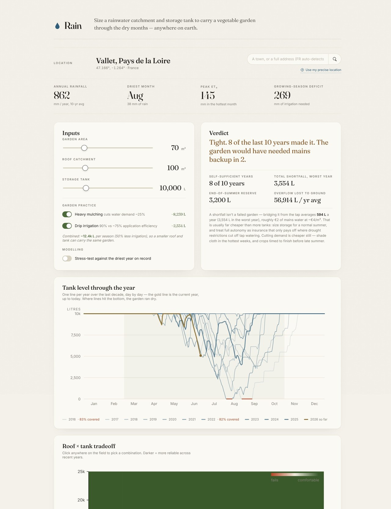

# Rain

Size a rainwater catchment + storage tank to carry a vegetable garden through the dry months — anywhere on earth.

**Live: <https://rainwater.hiccup.nl/>**



## What it does

Type a town or full address, set garden / roof / tank sizes, and the app simulates whether the system would have carried a vegetable garden through each of the last ten years at that location — plus the current year up to today. It shows day-by-day tank levels, a roof × tank reliability frontier, and the monthly water balance.

In France, the address can also auto-fill the roof catchment area from the official building cadastre (IGN BD TOPO), with an interactive satellite map for picking a different building if the geocoder lands on the wrong house.

## How it works

**Climate.** Ten complete years of daily rainfall and reference evapotranspiration (ET₀, FAO-56 Penman-Monteith) come from [Open-Meteo](https://open-meteo.com)'s ERA5 archive, fetched live for the chosen lat/lon, plus the current year up to the archive edge (~6 days ago).

**Crop water demand.** Daily ET<sub>crop</sub> = ET₀ × K<sub>c</sub> with a density-corrected K<sub>c</sub> curve for a typical home potager (peak 0.90 in July, not the FAO-56 monoculture-at-full-canopy 1.05 — see [Pereira et al. 2021](https://repositorio.ulisboa.pt/bitstream/10400.5/21814/1/REP-LEAF-FAO-5-Pereira%20et%20al-2021.pdf)), interpolated daily between month midpoints.

**Soil-moisture bucket.** A 25 mm readily-available-water reserve in the root zone (FAO-56: ~0.3 m vegetable rooting depth × 0.14 available water capacity × p ≈ 0.55). Rain tops the bucket up; excess percolates past the roots. Whenever ET empties the bucket, the gardener replaces the deficit from the tank. Effective rainfall thus *emerges* from the bucket — light summer rain counts fully, a winter downpour mostly drains away — instead of being a flat monthly fraction.

**Practice toggles.** Heavy mulching cuts ET<sub>crop</sub> ~25% (mulch halves soil evaporation, which is ~25–40% of ET for row crops — FAO-56 Ch. 10; Mao et al. 2024 review). Irrigation method sets application efficiency: 90% for drip vs ~75% for can/sprinkler (USDA-ARS figures).

**Roof yield.** daily_rain × roof_area × 0.8 (runoff coefficient with first-flush loss).

**Simulation.** Daily two-pass tank balance chained chronologically across the decade, with steady-state warmup. Tank fills from the roof, spills at capacity, drains to the garden, runs dry when empty. Daily stepping matters: monthly yield-after-spillage models systematically understate what a small, frequently-refilling tank delivers (Fewkes & Butler 2000; Mitchell 2007). The verdict counts how many complete years finished without a shortfall; the current partial year is drawn on the chart up to today but not counted.

**Sizing philosophy.** Storage has steeply diminishing returns: most of a "fully self-sufficient" tank exists only to bridge the rarest drought, replacing a few euros of mains water per year with thousands of litres of plastic. When a configuration falls short, the verdict therefore quantifies the mains top-up needed rather than treating those years as failures — the sensible target for most gardens is a tank sized for a normal summer plus tap backup, with demand-side measures (shade cloth, crop timing, soil improvement) before extra storage.

**Roof footprint (France only).** Address geocoded via [BAN](https://adresse.data.gouv.fr/), then the IGN [BD TOPO](https://geoservices.ign.fr/bdtopo) WFS returns the building polygons within ~40 m. Footprint area is computed from the polygon (equirectangular projection — sub-1% error for buildings). The horizontal projection is exactly the catchment area for vertical rain — pitched roofs collect the same amount as their footprint.

## Stack

Plain HTML + CSS + vanilla JavaScript. No build step, no framework, no third-party JS at runtime. SVG charts and map are hand-rolled. The whole app is three files (~50 KB).

External APIs, all CORS-open and no key required:

- [Open-Meteo](https://open-meteo.com) — daily rain + ET₀ archive, worldwide geocoding
- [BAN](https://adresse.data.gouv.fr/) — French address geocoding (forward + reverse)
- [BigDataCloud](https://www.bigdatacloud.com/) — worldwide reverse geocoding fallback
- [IGN Géoplateforme](https://www.geopf.fr/) — BD TOPO building polygons (WFS) and ortho-photos (WMTS)
- [OpenStreetMap](https://www.openstreetmap.org/) — base map tiles
- [ipapi.co](https://ipapi.co/) — IP-based initial location

## Deployment

GitHub Pages serves the repo on `main` directly at <https://rainwater.hiccup.nl/> with auto-managed Let's Encrypt HTTPS. Pushing to `main` is the deploy — no workflow, no build step, no secrets. The `CNAME` file in the repo root binds the custom domain.

The previous GCS bucket deployment path is retired. Keep `rainwater.hiccup.nl` pointed at `bartcortooms.github.io` via DNS; do not reintroduce bucket hosting or GitHub Actions deploy secrets unless the hosting model changes again.

## Local development

```sh
python3 -m http.server 8765
# open http://127.0.0.1:8765/index.html
```

No build step. The live-reload edit/refresh cycle is instant.
